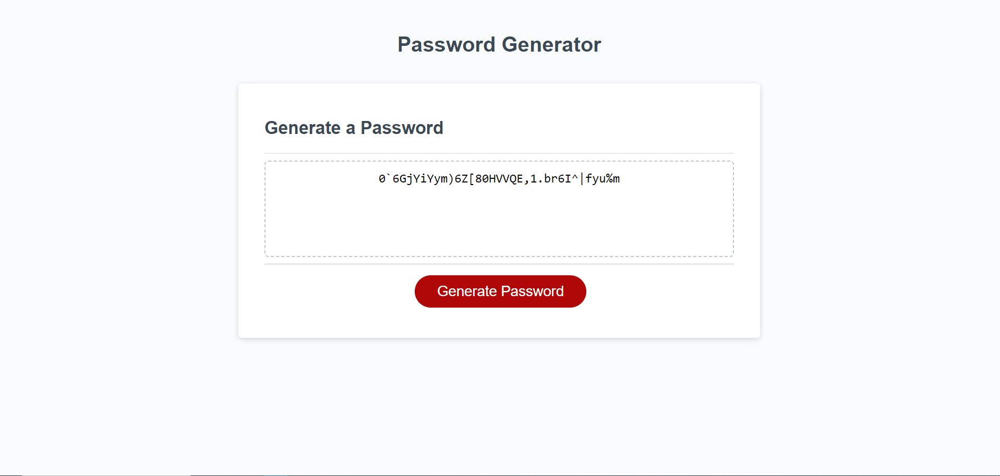

# Random Password Generator
This application allows the user to generate a randomized password. The user is asked a series of prompts regarding what kind of characters they would like to be included in the password as well as the desired length.
[Link](https://kylemoely.github.io/Random-Password-Generator/)

